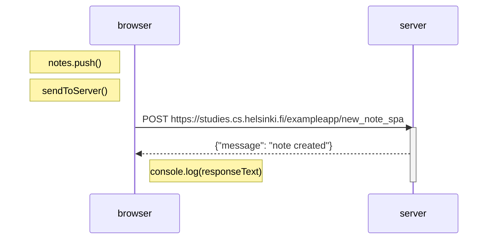

```mermaid
sequenceDiagram
    participant browser
    participant server

    Note left of browser: notes.push()
    Note left of browser: sendToServer()
    browser->>server: POST https://studies.cs.helsinki.fi/exampleapp/new_note_spa
    activate server
    server-->>browser: {"message": "note created"}
    Note right of browser: console.log(responseText)
    deactivate server

```
